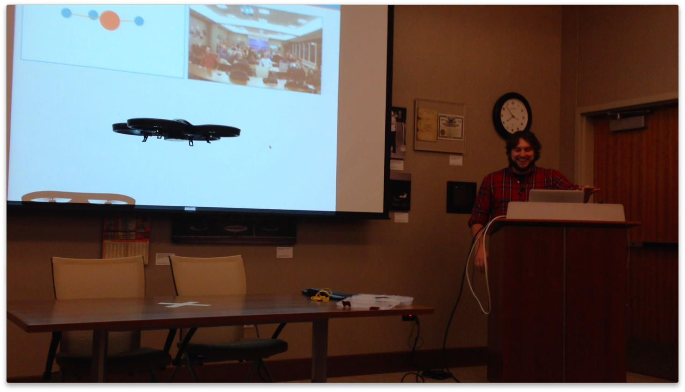
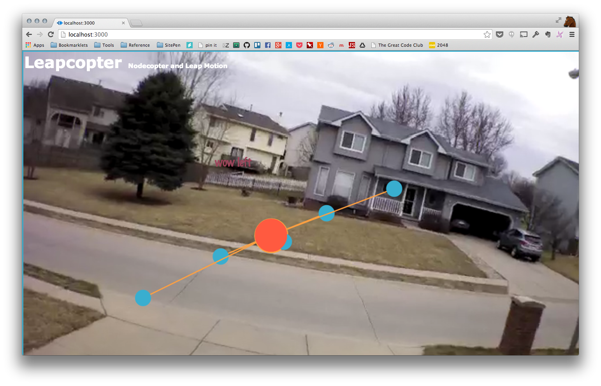

# Leapcopter

A leap motion nodecopter controller example

## Running

1. `npm install`
1. `bower install`
1. Connect your Leap Motion
1. Connect to your drone wifi
1. `node server`

### Actions

This demo supports the following actions:

1. __forward__ - tilt hand forward
1. __backward__ - tilt hand backward
1. __left__ - tilt hand left
1. __right__ - tilt hand right
1. __takeoff__ - tap finger
1. __flip__ - circle motion with finger

## Demo

* The original blog post is located [here](http://nicknisi.com/2014/01/05/leapcopter/) and the original youtube demo [here](https://www.youtube.com/watch?v=wRECaiWOaIA)
* A great video of my demo at NebrasjaJS recoreded by Matt Steele [here](https://www.youtube.com/watch?v=WXcbESGsfQM)
* My lightning talk at NebrasjaJS is [here](http://nebraskajs.com/2014/leapcopter/)
